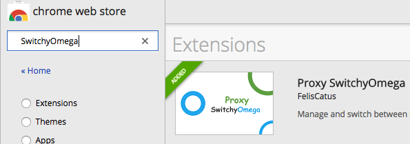
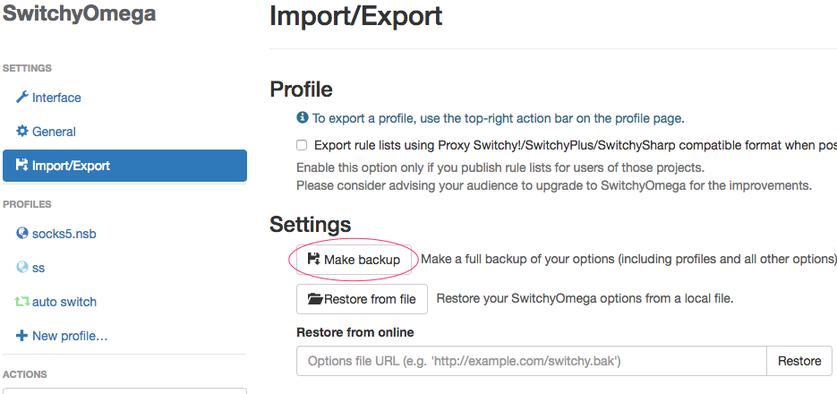
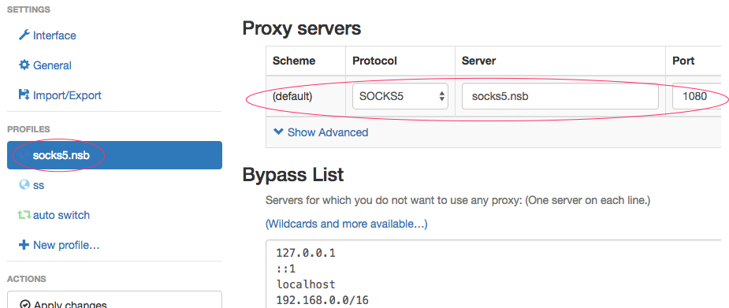
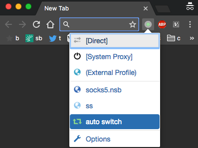

## 安装 chrome 插件 SwitchOmega

### 前提:

- 有可用的 socks5 代理服务
- chrome 没有安装 SwitchOmega
- chrome 无法打开 [chrome webstore](https://chrome.google.com/webstore)

### 解决:

- 通过设置 proxy 参数启动 chrome

先假设你的chrome浏览器位于 `/Applications/Google\ Chrome.app/Contents/MacOS/Google\ Chrome` 或 `C:\Program Files (x86)\Google\Chrome\Application\chrome.exe`

那么在命令行下执行以下命令:

    "chrome 路径" --show-app-list  --proxy-server="socks5://127.0.0.1:1080"

打开 [chrome webstore](https://chrome.google.com/webstore) 搜索并安装浏览器插件 `SwitchyOmega`

## 配置 SwitchOmega

导入我的配置 `OmegaOptions.bak`

把 `socks5.nsb` 改成你的代理服务地址

## 测试

选择可用的代理设置

打开 [whatismyipaddress.com](https://whatismyipaddress.com/) 查看配置是否生效
